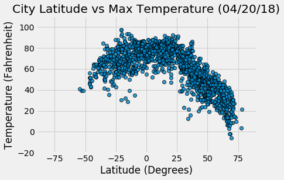
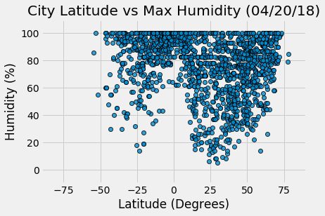
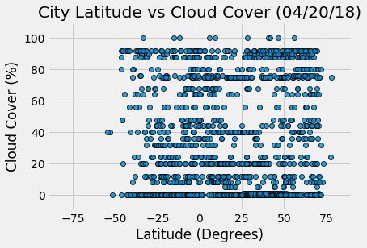
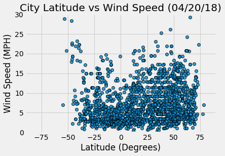

# WeatherPy
***

## Analysis

### Methodology
- 1835 samples gathered by picking 20 random longitudinal coordinates from each latitude (-90 to +90)
- Used citipy library to find nearest city / country code for each latitude / longitude combination, keeping only unique cities
- Fed city / country code combination to OpenWeather API -- returned data for 1,617 cities (88%).

### Observations
- The sample generally falls between 75S and 75N degrees latitude, probably because of the lack of human habitation at the poles (the north pole is entirely ocean, Antarctica has no cities).
- Temperature displays a distinct boomerang pattern. The southern hemisphere is entering autumn, so temperatures trend higher overall than the northern hemisphere, which is now entering spring. However, there is a clear trend on both sides toward higher temperatures as the latitudes near the equator.
- There seems to be a strong band of high humidity (between 80% and 100%) across the entire sample. However, there seems to be a higher relative proportion of cities immediately around the equator (between the Tropics of Cancer and Capricorn) with higher humidity. Interestingly, there seem to be two clusters around 25N and 25S -- perhaps because of the location of the Sahara (23N) and the Kalahari (23S) deserts? 
- Cloud cover does not seem to be correlated with latitude at all, but there does seem to be a cluster of lower wind speeds right over the equator.


```python
import openweathermapy
from citipy import citipy
import matplotlib.pyplot as plt
import pandas as pd
import random
import numpy as np
import requests
from config import api_key
from collections import defaultdict
import json
from matplotlib import style
style.use('fivethirtyeight')
import time
import datetime
```


```python
# set min/max coords for randomized search of cities
max_latitude = 90
min_latitude = -90
max_longitude = 180
min_longitude = -180

cities = []

#for latitude in range(min_latitude, max_latitude, 1):
for latitude in np.linspace(min_latitude, max_latitude, num=360, endpoint=True):
    for _ in range(1, 21):
        lng = random.uniform(min_longitude, max_longitude)
        lat = random.uniform(latitude, latitude + 1)
        city = citipy.nearest_city(lat, lng)
        city_data = f'{city.city_name},{city.country_code}'
        if city_data not in cities:
            cities.append(city_data)
            
#the free api only allows 60 calls per minute, so divide into 34 samples. This should get ~55 cities per split.
samples = np.array_split(cities, 34)

print("City Location Complete")
```


```python
# Save config information.
url = "http://api.openweathermap.org/data/2.5/weather?"
units = "imperial"

# Build partial query URL
query_url = f"{url}appid={api_key}&units={units}&q="

# set up dictionary to hold data
city_data_dict = defaultdict(list)

divider = f'*********************************'
print(divider)
print('* BEGINNING DATA RETRIEVAL..... *')
print(divider)

for index, target_cities in enumerate(samples):
    for idx, target_city in enumerate(target_cities):
        print(f'Processing Record {idx} of Set {index} | {target_city}')
        response = requests.get(query_url + target_city)
        response_data = response.json()

        #this is not a particularly pythonic way to build an exception, but in this program, we want all the data
        #or none of it. So if we get a 200 but there is a problem with one of the fields in the API, we do not want
        #it getting in the table. Dump the json() and troubleshoot. If we get anything but a 200, let us know about it.
        #It is mostly likely a 404 message, telling us it can't find the city. We will not load any data for a city we
        #can't find.
        if response.status_code == 200:
            print(f'Data found (status code: {response.status_code}) | {target_city}')
            try:
                city_data_dict['city_name'].append(response_data['name'])
                city_data_dict['city_country_code'].append(response_data['sys']['country'])
                city_data_dict['city_id'].append(response_data['id'])
                city_data_dict['city_lat'].append(response_data['coord']['lat'])
                city_data_dict['city_lng'].append(response_data['coord']['lon'])
                city_data_dict['city_max_temp'].append(response_data['main']['temp_max'])
                city_data_dict['city_humidity'].append(response_data['main']['humidity'])
                city_data_dict['city_wind_speed'].append(response_data['wind']['speed'])
                city_data_dict['city_cloud_cover'].append(response_data['clouds']['all'])
                city_data_dict['record_dt'].append(response_data['dt'])
                print(f'Data loaded successfully | {target_city}')
                print(divider)
            except KeyError:
                print(f'We got a good response (status code: {response.status_code}), but did not receive good info. \
                | {target_city }')
                print(f'API Response: ')
                print(json.dumps(response_data))
        else:
            try:
                print(f"ERROR: Data retrieval unsuccessful for {target_city}. Code: {response_data['cod']} \
                      MSG: {response_data['message']}")
            except KeyError:
                print(f'SEVERE ERROR: Data retrieval unsuccessful for {target_city}. Code: {response.status_code}')
    print("Sleeping 60 seconds before next round to avoid usage limits")
    time.sleep(60)
    
print(divider)
print("* DATA COLLECTION COMPLETE..... ")        
              


    
```


```python
# create dataframe from dictionary
city_data_df = pd.DataFrame(city_data_dict)

#Print a sample of the dataframe
city_data_df.head()

# calculate record date for plots
record_date = datetime.datetime.fromtimestamp(int(city_data_df['record_dt'][0])).strftime('%m/%d/%y')
```

## Latitude (Degrees) vs Max Temperature (F)


```python
# Build a scatter plot for each data type
plt.scatter(city_data_df["city_lat"],
            city_data_df["city_max_temp"],
            edgecolor="black", linewidths=1, marker="o",
            alpha=0.8, label="City")

# Incorporate the other graph properties
chart_title = f'City Latitude vs Max Temperature ({record_date})'
plt.title(chart_title)
plt.ylabel("Temperature (Fahrenheit)")
plt.xlabel("Latitude (Degrees)")
plt.grid(True)
plt.xlim([-90, 90])
plt.ylim([-20, 110])
plt.show()
```





## Latitude (Degrees) vs Humidity (%)


```python
# Build a scatter plot for each data type
plt.scatter(city_data_df["city_lat"],
            city_data_df["city_humidity"],
            edgecolor="black", linewidths=1, marker="o",
            alpha=0.8, label="City")

# Incorporate the other graph properties
chart_title = f'City Latitude vs Max Humidity ({record_date})'
plt.title(chart_title)
plt.ylabel("Humidity (%)")
plt.xlabel("Latitude (Degrees)")
plt.grid(True)
plt.xlim([-90, 90])
plt.ylim([-10, 110])
plt.show()
```





## Latitude (Degrees) vs Cloudiness (%)


```python
# Build a scatter plot for each data type
plt.scatter(city_data_df["city_lat"],
            city_data_df["city_cloud_cover"],
            edgecolor="black", linewidths=1, marker="o",
            alpha=0.8, label="City")

# Incorporate the other graph properties
chart_title = f'City Latitude vs Cloud Cover ({record_date})'
plt.title(chart_title)
plt.ylabel("Cloud Cover (%)")
plt.xlabel("Latitude (Degrees)")
plt.grid(True)
plt.xlim([-90, 90])
plt.ylim([-10, 110])
plt.show()
```





## Latitude (Degrees) vs Windspeed (MPH)


```python
# Build a scatter plot for each data type
plt.scatter(city_data_df["city_lat"],
            city_data_df["city_wind_speed"],
            edgecolor="black", linewidths=1, marker="o",
            alpha=0.8, label="City")

# Incorporate the other graph properties
chart_title = f'City Latitude vs Wind Speed ({record_date})'
plt.title(chart_title)
plt.ylabel("Wind Speed (MPH)")
plt.xlabel("Latitude (Degrees)")
plt.grid(True)
plt.xlim([-90, 90])
plt.ylim([0, 30])
plt.show()
```




